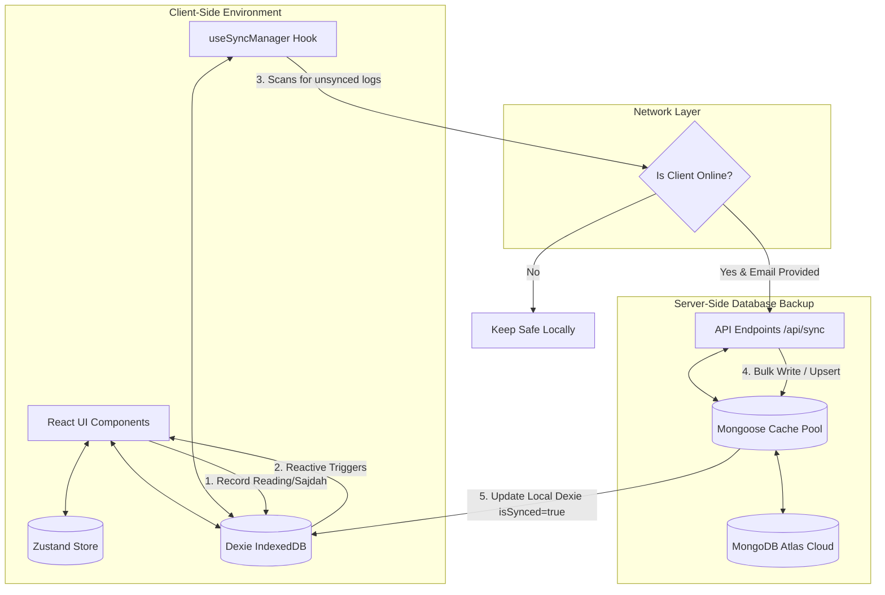

# 🕋 Hafiz Tracker — Complete Project Documentation

Welcome to the comprehensive technical documentation for **Hafiz Tracker**. This document is designed to serve as the definitive reference guide for understanding the architecture, features, data flow, tech stack, and development workflows of this premium, offline-first, cloud-synchronized Quran tracker.

---

## 📖 Executive Summary & Mission
**Hafiz Tracker** is a progressive Quran reading, Khatam, and Sajdah progression tracking application. The application is built using a modern, reactive stack designed to handle **offline-first functionality** beautifully. It leverages a local client-side IndexedDB database that automatically back-propagates sync changes to a cloud-based **MongoDB Atlas** cluster once network connectivity is verified.

Visually, Hafiz Tracker is styled around **premium Islamic aesthetics** with a dark forest-green (`#0F5132`) and crescent gold (`#D6B25E`) harmonious color system, offering full hardware dark-mode support, micro-animations, custom-designed mosque vector frameworks, and confetti graduation animations.

---

## 🛠️ Technology Stack Analysis

The application is structured on standard modern enterprise modules:

| Core Technology / Library | Purpose | Details / Version |
| :--- | :--- | :--- |
| **Next.js** | Core Full-Stack Framework | v16.2.4 (App Router, Serverless API Handlers) |
| **React** | Reactive Rendering Library | v19.2.4 |
| **Material UI (MUI)** | Visual Components Framework | v9.0.0 (Custom Green/Gold Islamic Palette) |
| **Zustand** | Global Configuration & Settings | v5.0.12 (Persisted in LocalStorage via `persist` middleware) |
| **Dexie.js** | Client-Side Database | v4.4.2 (Structured transactional IndexedDB wrapper) |
| **MongoDB Atlas / Mongoose**| Cloud Storage & Backup | Mongoose v9.6.1 (Serverless Connection Pooling) |
| **Recharts** | Analytics & Chart Generation | v3.8.1 (Dynamic daily/weekly/monthly trends) |
| **Zod** | Data Validation | v4.4.1 (Schema-safe input checks for logged items) |
| **date-fns** | Chronological Operations | v4.1.0 (Streak, month intervals, weekly aggregation calculations) |

---

## 📁 Repository Structure

```bash
Hafiz-Tracker-Project/
├── .env                  # MongoDB Atlas Connection String
├── package.json          # Main Scripts & Node Package Manifest
├── tsconfig.json         # TypeScript Typings Configuration
├── public/               # Static Web Assets (Favicon, Logos)
└── src/
    ├── app/              # Next.js App Router Page View Layers
    │   ├── page.tsx          # Hafiz Dashboard (Primary Entrypoint View)
    │   ├── achievements/     # Badge progression & JSON/CSV backups
    │   │   └── page.tsx
    │   ├── history/          # Advanced logs manager & correction dialogs
    │   │   └── page.tsx
    │   ├── sajdah/           # Simple Tilawah Sajdah tracker with location guide
    │   │   └── page.tsx
    │   ├── sajdah-debt/      # Sajdah payment ledger with dynamic circular progress
    │   │   └── page.tsx
    │   ├── stats/            # Analytics trends & cumulative progress lines
    │   │   └── page.tsx
    │   └── api/              # Serverless REST Routes
    │       ├── stats/        # Aggregates server logs for Recharts
    │       │   └── route.ts
    │       └── sync/         # Handles POST (logs backup) & GET (cloud restore)
    │           └── route.ts
    ├── components/       # Custom React Shared Wrapper Subsystems
    │   ├── AppThemeProvider.tsx  # Customized MUI Theme, Dark/Light palettes
    │   └── LayoutWrapper.tsx     # Islamic ambient animations, Sidebar, Bottom nav
    ├── hooks/            # Custom Hooks
    │   ├── useSajdahDebt.ts      # Calculates total Tilawah Sajdah debt
    │   └── useSyncManager.ts     # Triggers background syncing and offline checks
    ├── lib/              # Core Libraries and Database Instances
    │   ├── dailyLogs.ts          # Sorts and retrieves chronological logs
    │   ├── db.ts & hafizDB.ts    # Initializes local Dexie.js DB instance
    │   ├── mongoose.ts           # Initializes MongoDB connections (Cached Pool)
    │   └── sync.ts               # Core client-side sync helpers
    ├── models/           # Mongoose Data Models
    │   └── DailyLog.ts           # Defines DailyLog schema for MongoDB Atlas
    └── store/            # State Management Store
        └── useHafizStore.ts      # Zustand persisted settings and position
```

---

## 📊 System Architecture & Data Sync Flow

Hafiz Tracker implements a strict **offline-first local-first** synchronization flow:



> [!NOTE]
> Even if the user closes the browser or goes into a tunnel without network access, the app will continue to record progress locally. The moment a connection is re-established, the background `useSyncManager` synchronization executes a batch upload to MongoDB Atlas.

---

## 📂 Codebase Details & Walkthrough

### 1. Database Layer (Local & Cloud)

#### 🔸 Local IndexedDB: [hafizDB.ts](file:///Users/omor-faruk/Documents/My%20Project/untitled%20folder%202/Daly-quran-telaot/src/lib/hafizDB.ts)
Designed with a version-controlled store structure using Dexie.js for lightning-fast CRUD:
```typescript
export interface DailyLog {
  id?: number;
  date: string;       // YYYY-MM-DD
  endPara: number;    // Para completed (1-30)
  endPage: number;    // Page completed (0-20)
  sajdahsDone: number; // Sajdah count performed on this date
  loggedAt?: string;  // High precision timestamp
  isSynced: boolean;  // Tracks sync status
}
```
* **Store Config**: Indexed on auto-incremented primary keys (`++id`), `date`, and `isSynced`.

#### 🔸 Cloud Mongoose Schema: [DailyLog.ts](file:///Users/omor-faruk/Documents/My%20Project/untitled%20folder%202/Daly-quran-telaot/src/models/DailyLog.ts)
Mirrors IndexedDB attributes for server-side persistence while indexing the `userEmail` for multi-user backup safety:
```typescript
const DailyLogSchema = new mongoose.Schema({
  userEmail: { type: String, required: true, index: true },
  date: { type: String, required: true },
  endPara: { type: Number, required: true },
  endPage: { type: Number, required: true },
  sajdahsDone: { type: Number, required: true },
  loggedAt: { type: String },
}, { timestamps: true });
```

---

### 2. State & Sync Managers

#### 🔸 State Store: [useHafizStore.ts](file:///Users/omor-faruk/Documents/My%20Project/untitled%20folder%202/Daly-quran-telaot/src/store/useHafizStore.ts)
Leverages Zustand with the `persist` middleware to survive browser reloads. It holds core positional states:
* `userEmail`: Links offline profiles to remote backups.
* `lastPara` & `lastPage`: The absolute position in the Quran.
* `totalKhatams`: Incremented upon reading all 30 paras.
* `startNewKhatam()`: Resets reading coordinates, increments completed Khatams, and applies **15 mandatory Tilawah Sajdahs** to the user's debt.

#### 🔸 Background Sync: [useSyncManager.ts](file:///Users/omor-faruk/Documents/My%20Project/untitled%20folder%202/Daly-quran-telaot/src/hooks/useSyncManager.ts)
A custom hook that coordinates background updates:
1. Uses `useLiveQuery` to reactively watch for unsynced logs (`!isSynced`).
2. Checks connectivity (`navigator.onLine`) and sync identities.
3. Automatically triggers synchronization:
   * Instantly on app launch.
   * Instantly when returning online from offline mode.
   * Periodically in a **5-minute background loop**.
4. Sends logs to `/api/sync` and updates matching IndexedDB IDs to `isSynced: true`.

#### 🔸 Sajdah Debt Analyzer: [useSajdahDebt.ts](file:///Users/omor-faruk/Documents/My%20Project/untitled%20folder%202/Daly-quran-telaot/src/hooks/useSajdahDebt.ts)
Computes Tilawah Sajdah debt based on the 15 standard Qur'anic locations:
* **Khatam Earned**: `totalKhatams * 15`.
* **Current Khatam Earned**: Filters the `SAJDAH_POINTS` that are `<= lastPara`.
* **Calculated Debt**: `Math.max(0, totalEarned - totalSajdahsDone)`.

---

### 3. Serverless API Handlers

#### 🔸 Cloud Backups: [sync/route.ts](file:///Users/omor-faruk/Documents/My%20Project/untitled%20folder%202/Daly-quran-telaot/src/app/api/sync/route.ts)
* **`POST` (Upload)**: Receives log arrays from client and executes an optimized, non-blocking `bulkWrite` upsert:
  ```typescript
  const ops = logs.map((log) => ({
    updateOne: {
      filter: { userEmail: email, loggedAt: log.loggedAt },
      update: { $set: { ...log, userEmail: email } },
      upsert: true
    }
  }));
  await DailyLogModel.bulkWrite(ops, { ordered: false });
  ```
* **`GET` (Download/Restore)**: Queries the database based on email and returns chronologically ordered cloud logs, which the user can restore to clear local state.

#### 🔸 Remote Aggregations: [stats/route.ts](file:///Users/omor-faruk/Documents/My%20Project/untitled%20folder%202/Daly-quran-telaot/src/app/api/stats/route.ts)
Avoids computing heavy aggregations client-side. The server fetches raw logs for a user, orders them, calculates daily read differentials (accounting for Khatam wrapping boundaries where para transitions wrap from 30 back to 1), maps monthly totals, and feeds them into Recharts.

---

### 4. Modular Interactive Pages

#### 🏠 Main Dashboard: [page.tsx](file:///Users/omor-faruk/Documents/My%20Project/untitled%20folder%202/Daly-quran-telaot/src/app/page.tsx)
Displays the central interface of the app:
* **Quick Log Slider**: An elegant MUI Slider supporting single-step page (0–20) settings.
* **Interactive Para Map**: Grid system showing the status of all 30 Paras (completed, current, or locked) with detailed progress tooltips.
* **Goal Settings**: Dynamically configured in units of pages or paras.
* **Status Panels**: Quick cards displaying Monthly Progress, Streaks, and Sync States.

#### 📈 Advanced Statistics: [stats/page.tsx](file:///Users/omor-faruk/Documents/My%20Project/untitled%20folder%202/Daly-quran-telaot/src/app/stats/page.tsx)
* **Activity Trends**: Custom Recharts `BarChart` configured with primary gradients. Toggle filters aggregate statistics on Daily, Weekly, or Monthly bases.
* **Cumulative Progress**: Recharts `LineChart` representing total paras completed historically.

#### 📝 Reading History: [history/page.tsx](file:///Users/omor-faruk/Documents/My%20Project/untitled%20folder%202/Daly-quran-telaot/src/app/history/page.tsx)
An administrative list view enabling users to search dates (using `date-fns` parsers) and filter by months. Clicking an item opens a **Correction Dialog** to adjust the completed page/para positions manually. The dialog automatically updates matching IndexedDB fields and re-estimates the local Sajdah count.

#### 🏆 Achievements & Backups: [achievements/page.tsx](file:///Users/omor-faruk/Documents/My%20Project/untitled%20folder%202/Daly-quran-telaot/src/app/achievements/page.tsx)
Contains badge structures with conditional progress formulas:
1. **Steady Start** (3-day reading streak)
2. **One Week Strong** (7-day reading streak)
3. **Monthly Rhythm** (30-day reading streak)
4. **Goal Keeper** (Completed daily goal once)
5. **Seven Goals** (Goal completed 7 times)
6. **First Khatam** (Khatams completed >= 1)
7. **Sajdah Clear** (Pending Sajdah Debt == 0)
8. **5 Paras / Halfway Light / Khatam Ready** (Current position checkpoints)
* Includes **Local Exports** to download history files instantly as standard `.csv` spreadsheets or `.json` backups.

#### 🧎 Sajdah & Sajdah Debt Pages
* **[sajdah/page.tsx](file:///Users/omor-faruk/Documents/My%20Project/untitled%20folder%202/Daly-quran-telaot/src/app/sajdah/page.tsx)**: Displays the specific Surah name, Ayah coordinate, and completion status of the 15 standard Tilawah Sajdah locations. Includes quick-increment tools to log completed prostrations.
* **[sajdah-debt/page.tsx](file:///Users/omor-faruk/Documents/My%20Project/untitled%20folder%202/Daly-quran-telaot/src/app/sajdah-debt/page.tsx)**: Advanced ledger containing an elegant radial circular progress ring highlighting resolved vs pending debt, as well as a list of recent prostration dates.

---

## 🎨 Premium Theme & UI Design
Hafiz Tracker implements highly tailored ambient designs detailed in **[AppThemeProvider.tsx](file:///Users/omor-faruk/Documents/My%20Project/untitled%20folder%202/Daly-quran-telaot/src/components/AppThemeProvider.tsx)**:
* **Curated Harmonious HSL Palettes**:
  * **Primary (Deep Green)**: Light `#DFF6E9` \| Main `#0F5132` \| Dark `#0A3B26` (reminiscent of Quran bindings).
  * **Secondary (Crescent Gold)**: Light `#FEF7E6` \| Main `#D6B25E` \| Dark `#B68A28` (representing decorative gilding).
* **Typography**: Clean hierarchy relying on the premium **DM Sans** typeface.
* **Micro-Animations & Shadows**:
  * Hover translation shifts (`translateY(-1px)`) applied to buttons and cards.
  * Floating sidebar active icons (`navIconFloat`).
  * Crescent glowing vectors (`moonGlow`).
  * Smooth transition duration handlers.
* **Responsive Layout Wrapper**: Includes side nav on desktop layouts and an elegant bottom navigation bar on mobile interfaces.

---

## 🚀 Developer Guide & Workflows

### 1. Environment Variable Setup
Ensure you create a `.env` file in the root workspace directory with a valid MongoDB connection string:
```bash
MONGODB_URI=mongodb+srv://<username>:<password>@<cluster>.mongodb.net/hafizTracker
```

### 2. Available Commands
Manage the development servers using simple terminal scripts:

* **Start Dev Server**:
  ```bash
  npm run dev
  ```
* **Build Production Bundle**:
  ```bash
  npm run build
  ```
* **Run Linter Checks**:
  ```bash
  npm run lint
  ```

### 3. Developer Diagnostics Mode
When running the application in a local development environment (`process.env.NODE_ENV === 'development'`), a special red **"Reset app data (dev)"** button appears at the bottom of the log editor. 
> [!WARNING]
> Clicking this button clears all local IndexedDB tables, purges the Zustand `hafiz-storage` cache, and executes a full reload, resetting the app to a clean state.

---

*This document is maintained dynamically. If any system conventions evolve, please refer to the corresponding files linked within.*
